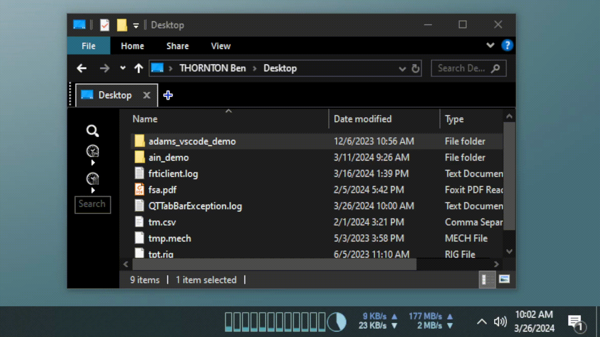

# Adams System Tray Utility

This is a simple system tray utility for [Adams](https://hexagon.com/products/product-groups/computer-aided-engineering-software/adams).

## Features
- List all running Adams View or Solver processes
- Open the working directory for a running Adams View or Solver process in Windows Explorer
- Kill a running Adams View or Solver process
- Kill all running Adams View or Solver processes

## Installation

### Windows

Download the [latest windows installer](https://github.com/bthornton191/adams_systray_util/releases/latest/download/adams_systray_util-1.0-win64.msi).

### MacOS ❌

Not yet available.

### Linux ❌

Not yet available.
